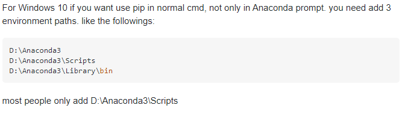
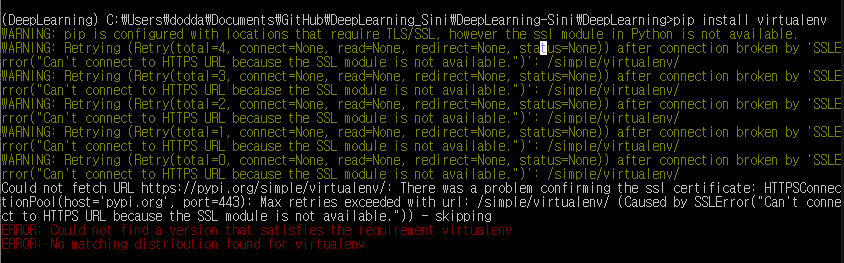
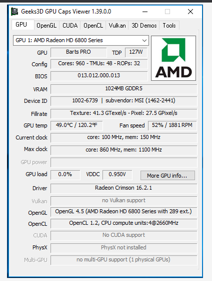
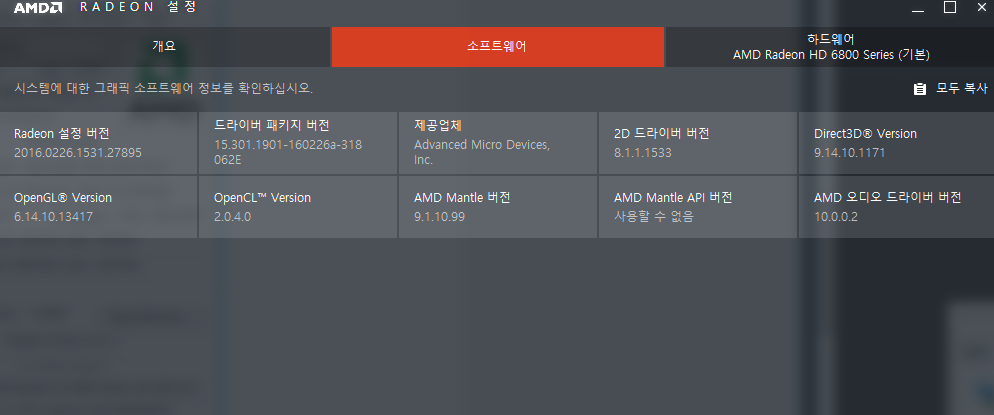
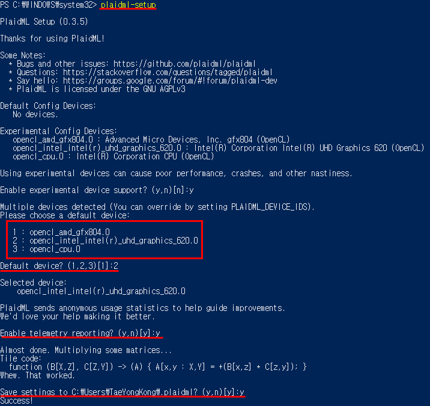
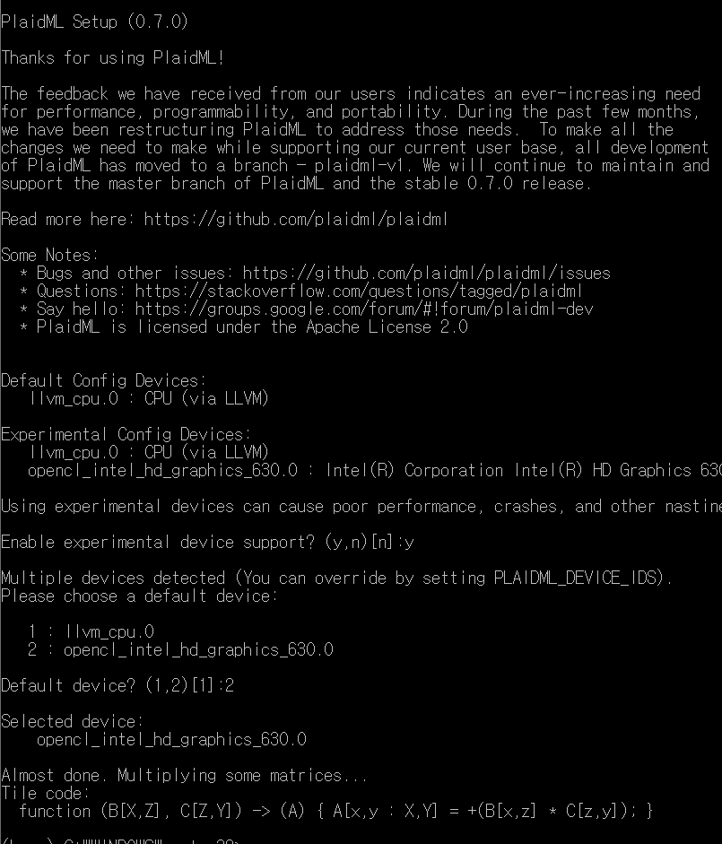
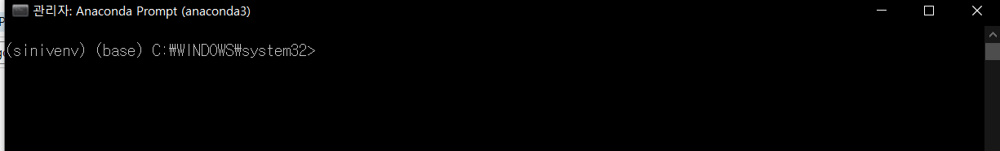
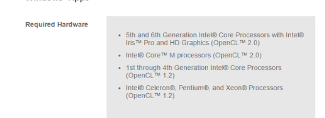
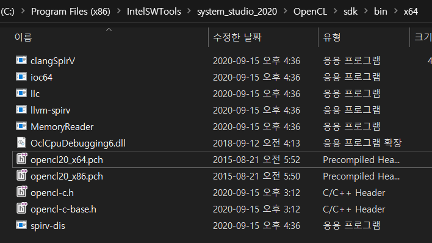

# Tensor Flow & Keras #1 \\ Deep Learning Tool Package 설치

**텐서플로우 문서 한글 번역본 ~!!!**

[https://tensorflowkorea.gitbooks.io/tensorflow-kr/content/](https://tensorflowkorea.gitbooks.io/tensorflow-kr/content/)

* Python Environment에서 일반 CMD 에서 python 명령어나 pip명령어를 사용할 수 없었던 이유



* 특이한 부분은 아래와 같이 명령프롬프트에서 venv의 activate.bat 을 실행해 virtual environment를 실행해도 일반 CMD 에서는 설치가 진행되지 않는 다는 것이다.



* 정말 나를 짜증나게 하는건 노트북에서는 Anaconda에서 virtual env는 설치가 되는데 tensorflow가 설치가 안된다는것 
* 일단 진행해보자면 텐서 플로우 CPU버전에 설치 성공 ( PC, Labtop은 실패) 
    * [https://towardsdatascience.com/setup-an-environment-for-machine-learning-and-deep-learning-with-anaconda-in-windows-5d7134a3db10](https://towardsdatascience.com/setup-an-environment-for-machine-learning-and-deep-learning-with-anaconda-in-windows-5d7134a3db10)

* Ipython 설치하는것을 잊어버림..

* **keras **

```
pip install keras
```

* **tensor flow **

```
[Nvidia 소프트웨어가 설치되어있어야 함]https://www.tensorflow.org/install/gpu?hl=ko
[CUDA Path 설정]
[가상환경 설정]
pip install --upgrade tensorflow
python -c "import tensorflow as tf; print(tf.reduce_sum(tf.random.normal([1000, 1000])))"
```

* 노트북에서 TENSOR FLOW 설치가 되지 않았던 이유

TENSORFLOW는 3.9 특히 32비트에서는 호환이 되지 않는 것으로 보인    

*   Conda Environment (3.7, 3.8. Version) 에서는 설치가 완료되었다.. 
    * 가상환경을 생성할 때 virtualenv를 사용하여 3.9에서 설치 오류가 발생한 것으로 보인다. 
    * 확인해보니 python 3.9 64bit로 보이지만, 내가 얼떨결에 앱스토어에서 설치한 것이므로 언인스톨하고 다시 깔기로 결정하였다.
    * python path 설정에 따라서 C드라이브에 있는 python이나 Anaconda 폴더에 있는 python 버전 중 가까운 패스의 버전이 출력되는것 같다.
    * python 홈페이지에서 64bit Installer를 새로 다운받음

```
>>> import platform
>>> print(platform.architecture())
python 64 비트 확인
```

* 64비트로 변경 후 CMD 에서도 TensorFlow 설치가 가능했음 
    * 그러나 다시, Venv 로 생성한 가상환경에서는 같은 문제가 발생하는 것을 확인
    * 애초에 문제를 잘못 짚었던 것으로 생각된다. 
    * python -m ensurepip --default-pip
    * 이 명령어를 수행하면 컴퓨터에 pip 가 있는지 찾아주는 것 같다. 
    * python -m pip install --upgrade pip
    * 상기 방법으로 python 의 작동 방법에 대한 한층 더 깊은 이해가 가능했다. 
    * 처음 3.9 python이 path에만 추가되었을 때는 libarary에 대한 path는 없으므로 pip 가 Install 되어있지 않다. 
    * 그러므로 Conda에 있는 pip list가 출력되었던 것
    * python 3.9에서 pip 설치를 완료하고 나서야 3.9 버전에서는 64, 32 비트와 무관하게 tensorflow 설치가 불가능하다는 것을 깨달았다.

---

* AMD 그래픽 카드 이용 방법

**Plaid ML 이용 방법 **

* **Intel Cpu를 사용하기 위한 Intel 개발 GPU 확장 툴 **

**NVIDIA 그래픽 카드는 CUDA를 사용하여 간편하게 이용할 수 있지만 다른 그래픽 카드는 호환성이 뛰어나지 않다. 다음은 그래픽 카드 사용을 위한 툴 조사한 이름 **

* **ROCM**
    * **OPENCL **
    * **PLAIDML**

[https://plaidml.github.io/plaidml/docs/install#windows](https://plaidml.github.io/plaidml/docs/install#windows)

[https://plaidml.github.io/plaidml/docs/install.html](https://plaidml.github.io/plaidml/docs/install.html)

[https://registrationcenter.intel.com/en/products/postregistration/?sn=C9B3-XBJ2X7HP&Sequence=2986381&encema=Wg/bUFJY2qspv9ef8QA1f16TYbzVEBfiyecPEIzW+eibz5xMxWtKOUkBiBOkiy6I+lVd40kQ1XO/WXm9P7qE+A==&dnld=t&pass=yes](https://registrationcenter.intel.com/en/products/postregistration/?sn=C9B3-XBJ2X7HP&Sequence=2986381&encema=Wg/bUFJY2qspv9ef8QA1f16TYbzVEBfiyecPEIzW%2Beibz5xMxWtKOUkBiBOkiy6I%2BlVd40kQ1XO/WXm9P7qE%2BA==&dnld=t&pass=yes)

* Plaidml-setup 명령어 오류 발생 
    * 3.9 python powershell 에서 실패 (Authorized)
    * 3.7 python in Anaconda prompt에서 성공 (Authorized)
    * 3.8 에서 성공, chocolate 은 python이 이미 설치된 경우에는 필요가 없음 
        *  이어서, keras 와 Plaidml을 설치하였고 
        *  OpenCL 다운로드 함 (Plaidml-setup에서 OpenCL이 뜨지 않아서) 
        * 해결이안되었음, 
        * 
        
        
        * Radeon HD 6800 은 1.2cl이라고 뜨는데
        * 
        
        
        * 이렇게 매니져는 다른말을 함, Radeon Software 을 16.2.1에서 15.11.1로 바꾸기로 함 
        * 바꾼 후에도 차도는 없음, 그래픽 카드가 오래되어 인식하지 못하는 툴이 있다는 것이 지배적
        * 결국 CPU로 설정하고 Plaid-bench는 확인하였으니 Keras는 돌아가지 않을까 하는 작은 기대를 함 
        * "pip install -U plaiml-keras는 keras최신 버전이 아님 (현 2.4.3), 그러나 plaidml 0.7.0은 2.2.4 에서 구동을 함(시발) 
        *

* 실행 성공 예시
* 



* 내 실행 화면

* Plaidml-setup 으로 사용할 GPU를 설정하였음, 또 다른게 필요한가?
    * 그래픽 카드 설정에서 실패하였음, 이유는 무엇인지 모르겠음 Multiplying some matrices 
    * 포럼에서의 제안
    * C:\devtool\py36x64\Scripts>set PLAIDML_VERBOSE=1
    * C:\devtool\py36x64\Scripts>plaidml-setup.exe

* 추가적인 문제를 찾을 수가 없었음, 아마도 메모리 문제인 듯 하여 개인PC로 다시 실행해야 할듯
    * 혹시 몰라 python environment를 다시 설정 (3.9-> 3.7 -> 3.3 으로 버전이 점점 낮아지는 중 )
    * Stack Over Flow로 해보는건?
    * 전체적인 시스템 손상을 막기 위해 venv 설정 중 
    * OpenCL 다운로드도 완료하였음 
    * python -m venv C:\Users\dodda\sini-keras
    * 또는 (Python dirctory) -m venv (User Directory)



* 가상환경 접속 모습

```
* set the environment variable PLAIDML_VERBOSE=1 and rerun plaidml-setup
* create a virtual environment and rerun plaidml-setup

이 두개가 개발자의 해결 방안이었음 
*** 내 에러 메세지 ***
DEBUG:plaidml:Minimal loc count: 5 Remaining mem: 0
DEBUG:plaidml:Final loc count: 5 Remaining mem: 0
```

* 가상환경에서-- plaidml-keras에서 추천한거 사용해 보자

```
-python
choco install -y python git vcredist2015
-keras
pip install -U plaidml-keras
plaidml-setup
-test
pip install plaidml-keras plaidbench
plaidbench keras mobilenet
```

* Open CL과 그래픽 카드 드라이버 버전이 영향을 주는걸 수도 있다. (장치관리자에서 디스플레이 디바이스-확인-드라이버 정보)


*  "
    * 출처:
    * 이 말은 OpenCL 이 되어야 Intel GPU를 사용할 수 있다는 말이고, CPU연산을 도울 수 있도록 변환이 가능하다는거 아닐까





* 일단 bin에 설치되어있는것은 "OPENCL20" 이니 2,0 버전으로 생각된다.. 그럼에도 안되는 이유는????
